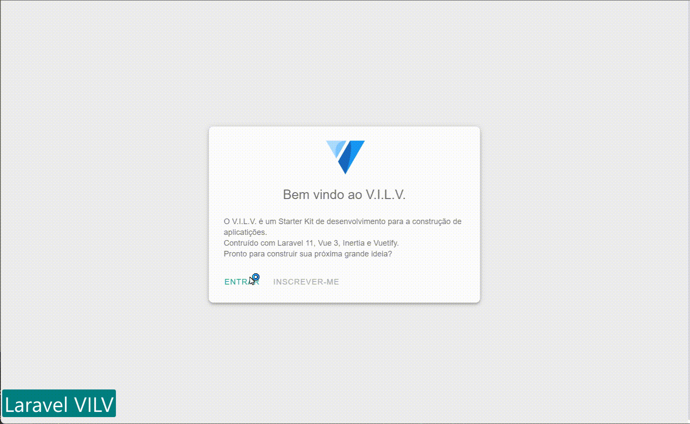

# **VILV Laravel 11**
## Laravel + Vue + Vuetify + Inertia Boilerplate


**VILV** Laravel 11 é um kit inicial para [**Laravel**](https://laravel.com/), [**Vuetify 3**](https://vuetify.vom/) e [**Inertia.js**](https://inertiajs.com/). Ele vem com recursos de importação automática e aproveita os melhores e mais recentes recursos do [**Vue 3**](https://vuejs.org/).

Este kit inicial é projetado para ser simples e flexível. Ele é construído com base em práticas recomendadas e será, `dentro das minhas possibilidades e/ou ajuda da comunidade,` constantemente atualizado com as últimas tecnologias. Ele vem com um sistema de notificação do sistema acionado por servidor, diálogos orientados ao servidor, layouts persistentes de inércia inline e muito mais.

O **VILV** foi inspirado nos projetos [**Pronto Fuel**](https://github.com/prontostack/pronto-fuel), de [**Matheus Dal'Pizzol**](https://github.com/MtDalPizzol) e [**laravel-inertiajs-vuetify-starterkit**](https://github.com/ahmadfaizk/laravel-inertiajs-vuetify-starterkit) e é mantido por [**kallbuloso**](https://github.com/kallbuloso).



# Importante
Em breve, o **VILV** terá uma documentação completa e um guia de uso mais detalhado.

Para um futuro próximo, o **VILV** terá um gerador de CRUD para facilitar a criação de novos recursos.

Mais futuramente o **VILV** terá um sistema de autenticação completo com permissões e papéis.

## Pré-requisitos

```bash
# PHP ^8.2
# Composer ^2.7.*
# Node.js ^20.*
# NPM ^10.*
```

## Features

- ⏩ [Inertia.js](https://inertiajs.com/)
- 🔰 [Vue 3](https://github.com/vuejs/core)
- 📦 [Laravel 11](https://laravel.com/)
- ⚡️ [Vite](https://vitejs.dev/)
- 🔥 Use a nova sintaxe [`<script setup>`](https://github.com/vuejs/rfcs/pull/227) para Vue
- 📦 Importação automática de [componentes](https://github.com/antfu/unplugin-vue-components)
- ⬇️ [Importação automática de APIs Common Vue e Inertia](https://github.com/antfu/unplugin-auto-import)
- ✂️ Divisão de código de páginas pronta para uso
- 🔔 Sistema de notificação do sistema acionado por servidor com fila instalada
- 💬 Diálogos orientados ao servidor
- ⚓ Layouts persistentes de inércia inline
- ❄️ [Vuetify Framework](https://vuetify.vom/) configurado imediatamente com os melhores componentes do Material Design prontos para usar
- 📦 Gerenciamento de estado com [Pinia](https://github.com/vuejs/pinia)
- 😃 [Use ícones de qualquer conjunto de ícones, sem compromisso](https://github.com/antfu/unplugin-icons)
- 👮 Aplique a qualidade do código com [ESLint](https://eslint.org/) e [Prettier](https://prettier.io)
- 🚨 Teste com [PHPUnit](https://phpunit.de/)

## Início rápido com VSCode

```bash
# Clonar o repositório
git clone git@github.com:kallbuloso/vilv.git neu-vilv

# Entre no diretório do projeto
cd neu-vilv

# Crie o arquivo .env com base no exemplo fornecido
cp .env.example .env

# Instale as dependências PHP
composer install

# Gere uma chave APP para segurança
php artisan key:generate

# Crie um banco de dados SQLite
touch database/database.sqlite
- ou -
# Crie um banco de dados MySQL e atualize o arquivo .env
DB_CONNECTION=mysql
DB_HOST=127.0.0.1
DB_PORT=3306
DB_DATABASE=vilv
DB_USERNAME=root
DB_PASSWORD=password

# Crie as tabelas do banco de dados
php artisan migrate --seed

# Instale as dependências de front-end
npm install

# Atualizar configurações do servidor em vite.config.js
server: {
    port: 3000
},

# Servidor de desenvolvimento do Lift Vite
npm start

# Ou iniciar servidor de desenvolvimento Laravel
php artisan serve

# Iniciar servidor de desenvolvimento Laravel com outra porta
php artisan serve --port=7000

# Acesse 
http://localhost
```

## Formatando

```bash
# Formatar PHP
composer format

# Formatar JavaScript
npm run format
```
# Todos
### Feitos
```bash
✔  Instalar laravel/breeze -vue
✔  Remover TailwindCSS
✔  Adicionar Vuetify 3
✔  Melhorar CSS do Vuetify
✔  Adicionar e configurar Eslint
✔  Adicionar e configurar Prettier
✔  Configurar Vite
✔  Adicionar layouts persistentes inline
✔  Adicionar Pinia
    ✔  toggle de tema (claro/escuro)
    ✔  toggle de v-navigation-drawer
✔  Adicionar importação automática de componentes, Layouts e Transições
✔  Adicionar sistema de notificação toast do lado servidor com Sweetalert2
✔  Adicionar importação automática de recursos utils
    ✔  helpers
    ✔  formatters
    ✔  validators
    ✔  headers
    ✔  metadata
    ✔  pagedArray (Paginação)
    ✔  sweetalert2
✔  Tornar o projeto público
```
### Em andamento
```bash
🚧 CRUD de exemplo com paginação
```
### A fazer
```bash
✘ Adicionar sistema de autenticação com controle de permissões e papéis
✘ Adicionar importação automática de `APIs`
✘ Adicionar diálogos orientados ao servidor
✘ Adicionar modals
✘ Adicionar documentação
✘ Criar site para demonstração
```
### Futuro
```bash
✘ Adicionar gerador de CRUD
```

## Contribuições
Contribuições são bem-vindas! Sinta-se à vontade para abrir um problema ou enviar uma solicitação de pull.

## Licença
MIT - Esta é uma licença de software livre muito permissiva que permite que você faça o que quiser com o código, desde que forneça atribuição e não responsabilize os autores. Leia o arquivo [LICENSE](License) para obter mais informações.

## Disclaimer
Este projeto é um trabalho em andamento e está em constante evolução. Ele é fornecido "como está" e sem garantias de qualquer tipo. Use por sua conta e risco.
